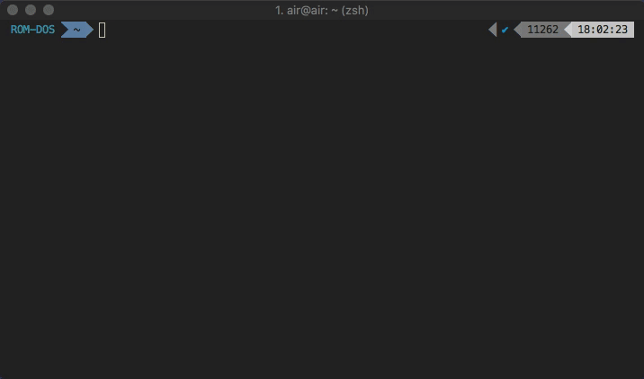
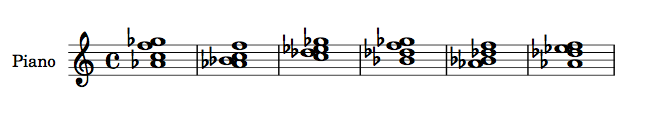
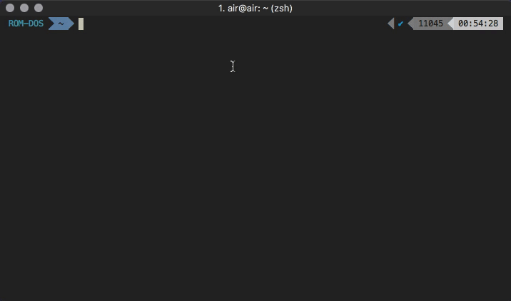
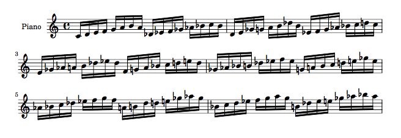

<p align="center">

</p>

<p align="center">
  <strong>compositional tools for generating LilyPond data and rendering MIDI</strong>
</p>
<hr>

<p align="center">
  <a href="https://github.com/standard/standard"></a>
</p>

## Overview

`soma-cli` is a Node.js-based CLI, providing compositional tools for generating PDF scores and MIDI files of musical material.

Despite the abundance of emerging music projects taking advantage of the Web Audio API, few, if any, offer exportability to formats supported by modern Digital Audio Workstations. This seems to limit their application to that of novelty -- undoubtedly creative in exploring modern web technologies, but ultimately impractical for use in the workflow of professional musicians and digital composers.

The existing [LilyPond](http://lilypond.org/) project is already excellent at what it does: generating PDFs of musical scores and optionally, MIDI files of the output score. However, the syntax can be tedious for those who don't want to have to write markup language just to generate music.

`soma-cli` aims to provide a set of modular tools for generating musical material that can then be immediately integrated into a musician's mature process. It abstracts away common musical conventions and choices a musician may make, quickly providing raw materials to later be developed as the user sees fit. The intention is not to realize a system that writes music for you, but rather one that hopefully takes some of the tedious busy work out of making music.

## Examples

<p align="center">

</p>

The `soma-cli chordGen minor eb 4 sort 6` command above, will generate the [PDF](20181108-17-26-55.pdf) below (or 6 other random 4-note chords from the Eb minor scale):

<p align="center">

</p>

as well as an accompanying [MIDI file](examples/20181108-17-26-55.midi) of the exact same musical material.

<p align="center">

</p>

The `soma-cli printScale major all 16 fold` command above, will generate the [PDF](examples/20181108-00-55-20.pdf) output below:

<p align="center">

</p>

as well as an accompanying [MIDI file](examples/20181108-00-55-20.midi) of the exact same musical material.

## Installation

```bash
npm i -g soma-cli
```

**Note**: you will also need to install [LilyPond](http://lilypond.org/). `soma-cli` uses this for automatically compiling the output `.ly` files into `.pdf` and `.midi`.

`soma-cli` currently only offers support for macOS. Extending support to Linux and Windows is relatively trivial, and will be added in future releases.

If you are receving a `Cannot find module` error upon installing and running `soma-cli`, you likely need to point your `NODE_PATH` to the correct directory. You can do so by adding the following line to your `.bashrc` or `.zshrc`, depending on your shell:

```bash
export NODE_PATH=/usr/local/lib/node_modules
```

Upon first running, `soma-cli` will create a `soma-output` directory in your Home directory (`~`). All output will be saved there.

Each rendering of music material will be saved as unique files (in `.ly`, `.pdf` and `.midi` formats), timestamped with the time of its rendering (in `YYYYMMDD-HH-MM-SS` format).

## Commands

### `printScale` (alias: `ps`)

Prints a scale (or multiple scales), with several different parameters

```bash
soma-cli printScale <sType> <key> <quant> <tail>
```

#### `<sType>` - Scale type

| Scale type | Argument |
| ---------- | -------- |
| Major      | `major`  |
| Minor      | `minor`  |

#### `<key>` - Key

| Key                   | Argument |
| --------------------- | -------- |
| C                     | `c`      |
| Db                    | `db`     |
| D                     | `d`      |
| Eb                    | `eb`     |
| E                     | `e`      |
| F                     | `f`      |
| Gb                    | `gb`     |
| G                     | `g`      |
| Ab                    | `ab`     |
| A                     | `a`      |
| Bb                    | `bb`     |
| B                     | `b`      |
| All keys (from C - B) | `all`    |

`soma-cli` also accepts a user-defined sequence of keys, provided as a `String`, as its `<key>` argument. For example, `'c db e f'` will print the keys C, Db, E and F, in that order. The key sequence can be of any length.

#### `<quant>` - Quantization of scale

| Quantization               | Argument |
| -------------------------- | -------- |
| Whole note (1/1)           | `1`      |
| Half note (1/2)            | `2`      |
| Quarter note (1/4)         | `4`      |
| Eighth note (1/8)          | `8`      |
| Sixteenth note (1/16)      | `16`     |
| Thirty-second note (1/32)  | `32`     |
| Sixty-fourth note (1/64)   | `64`     |
| Hundred twenty-eighth note (1/128) | `128`    |

Dotted notes can be indicated by adding a `.` after the integer argument (i.e. `8.`)

#### `<tail>` - Sets the "tail" of the scale

| "Tail"                            | Argument |
| --------------------------------- | -------- |
| Rest                              | `rest`   |
| Add the second to last note       | `fold`   |
| Add the first note (up an octave) | `turnup` |


### `chordGen` (alias: `cg`)

Generate chords within a given key

```bash
soma-cli chordGen <type> <key> <count> <order> <num>
```

#### `<type>` - Scale type

Same scales are available as in the `printScale` command

#### `<key>` - Key

Same keys are available as in the `printScale` command

#### `<count>` - Number of notes in the chord

An integer from `1` - the selected scale length. Unique chord permutations are limited based on the total number of notes in the selected scale, and number of notes selected per chord.

#### `<order>` - Ordering of notes in the chord

| Ordering                                                  | Argument |
| --------------------------------------------------------- | -------- |
| Sort notes alphabetically                                 | `sort`   |
| Sort notes in the order they were generated (i.e. random) | `unsort` |

#### `<num>` - Number of chords to generate

A number from `1` - ∞. Unique chord permutations are limited based on the total number of notes in the selected scale.

## Version History

See [CHANGELOG](./CHANGELOG.md) for full details

## Contributing

Still in early gestation, the project will primarily be cared for and developed by its original maintainer (me). If you are interested in getting involved in the project, have issues or feedback, please reach out to me directly -- morera.computer@gmail.com

## License

MIT © 2018 Nicholas Morera
